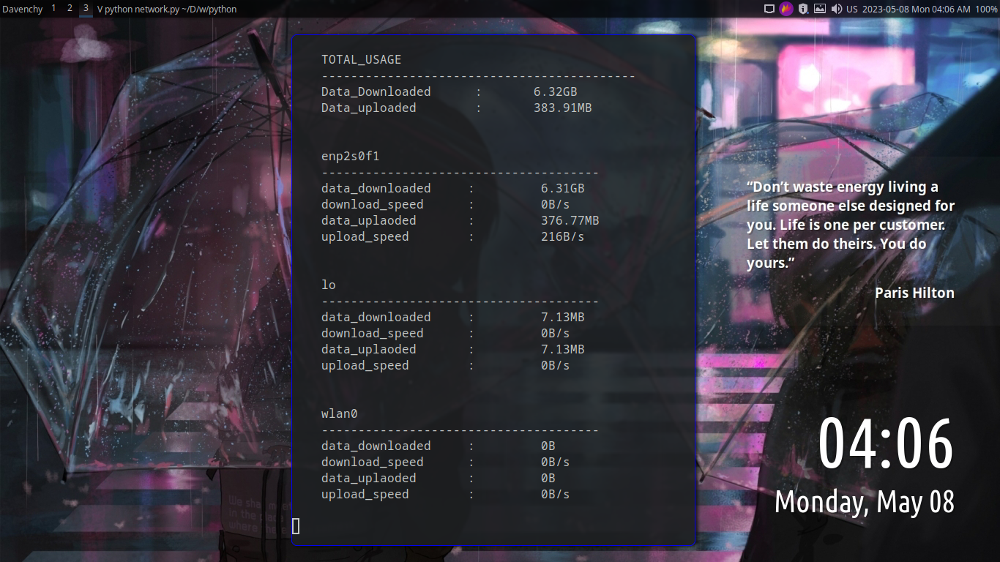

## CLI Network Monitor for linux
<p align="center">
  
</p>

### to install it
first install psutil module
```
pip install psutil
```
clone the repo
```
git clone https://github.com/M1-Elmasry/CLI_network_monitor.git && cd CLI_network_monitor/
```
then add the main file to bin dir and make it executable and rename it with the name you want  
in my case i will rename it with "net_monitor"
```
mv ./network.py /usr/bin/net_monitor
sudo chmod +711 /usr/bin/net_monitor
```
execute
```
net_monitor
```
