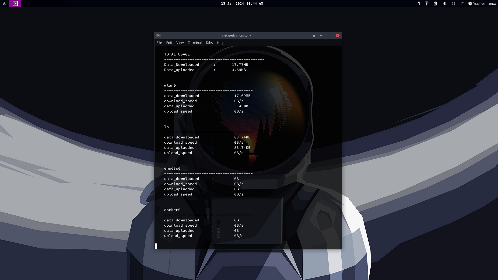

# Network Usage Monitor

A simple Python script to monitor real-time network usage on your device.

## Usage

1. **Run the Script:**
   - Make sure you have Python 3.x installed.
   - Execute the script using: `python script_name.py`

2. **Monitor Network Usage:**
   - The script displays total data downloaded/uploaded and individual interface statistics.
   - Interface-specific details include download/upload speed.

## Requirements

- Python 3.x
- psutil library (`pip install psutil`)

## Contributing

If you encounter issues or have suggestions, please open an issue or submit a pull request. Contributions are appreciated!
